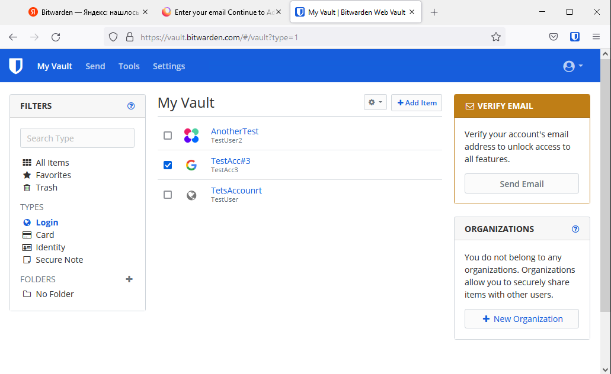
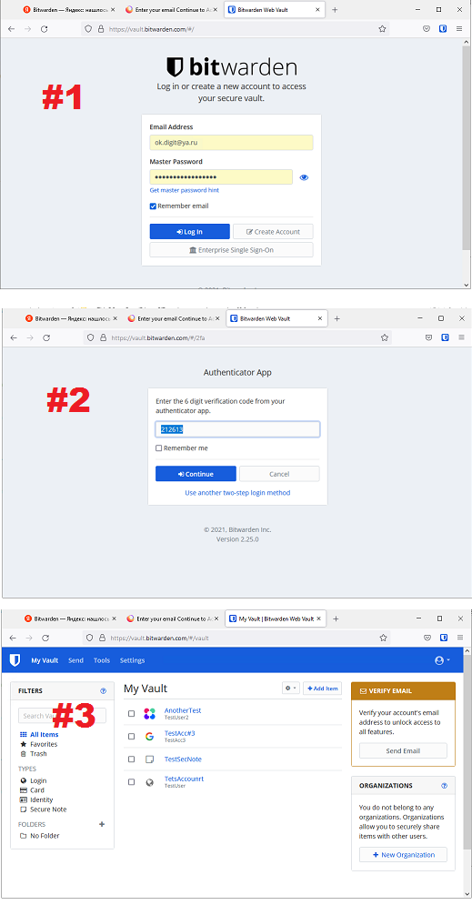
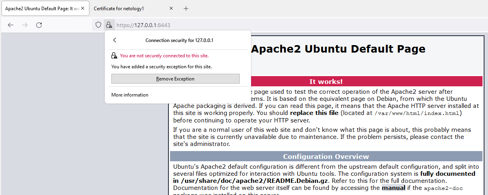

# Домашнее задание к занятию "3.9. Элементы безопасности информационных систем"

## 1. Установите Bitwarden плагин для браузера. Зарегестрируйтесь и сохраните несколько паролей.



## 2. Установите Google authenticator на мобильный телефон. Настройте вход в Bitwarden акаунт через Google authenticator OTP.

### 2.1. Установите Google authenticator на мобильный телефон.  

**Выполнено**  

### 2.2. Настройте вход в Bitwarden акаунт через Google authenticator OTP.  

**Выполнено по [инструкции "Bitwarden Authenticator (TOTP)"](https://bitwarden.com/help/article/authenticator-keys/)**  

  

Здесь:  

 * #1 - Приглашение Bitwarden на ввод логина и пароля  
 * #2 - Приглашение Bitwarden на 6-цифрового OTP (One Time Password) из программы "Google authenticator"  
 * #3 - Отображение главного окна приложения в браузере после успешного входа.  


## 3. Установите apache2, сгенерируйте самоподписанный сертификат, настройте тестовый сайт для работы по HTTPS.

### 3.1. Установите apache2

Проверим имя ВМ и локальные адреса:
```bash
root@netology1:~# hostname -s
netology1
root@netology1:~# hostname -f
netology1.netology.test
root@netology1:~# hostname -i
127.0.0.1 10.0.2.15
root@netology1:/etc/apache2# cat /etc/hostname
netology1.netology.test
root@netology1:/etc/apache2# cat /etc/hosts
127.0.0.1       localhost
...
127.0.0.1       netology1.netology.test netology1
10.0.2.15       netology1.netology.test netology1
...
```

Установим пакет Apache2 из репозитория:

```bash
root@netology1:~# apt install apache2
Reading package lists... Done
Building dependency tree
Reading state information... Done
The following additional packages will be installed:
  apache2-bin apache2-data apache2-utils libapr1 libaprutil1 libaprutil1-dbd-sqlite3 libaprutil1-ldap libjansson4 liblua5.2-0 ssl-cert
...
```

Проверим, что сервис установлен:
```bash
root@netology1:~# systemctl status apache2
● apache2.service - The Apache HTTP Server
     Loaded: loaded (/lib/systemd/system/apache2.service; enabled; vendor preset: enabled)
     Active: active (running) since Mon 2021-12-13 07:25:59 UTC; 20s ago
       Docs: https://httpd.apache.org/docs/2.4/
   Main PID: 1411 (apache2)
      Tasks: 55 (limit: 1071)
     Memory: 5.6M
     CGroup: /system.slice/apache2.service
             ├─1411 /usr/sbin/apache2 -k start
             ├─1412 /usr/sbin/apache2 -k start
             └─1413 /usr/sbin/apache2 -k start

Dec 13 07:25:58 netology1.netology.test systemd[1]: Starting The Apache HTTP Server...
Dec 13 07:25:59 netology1.netology.test systemd[1]: Started The Apache HTTP Server.
```

### 3.2. Сгенерируйте самоподписанный сертификат.

Сгенерируем с помощью OpenSSL самоподписанный серитификат и включим поддержку SSl в Apache:

```bash
root@netology1:~# cd /etc/apache2
root@netology1:/etc/apache2# mkdir ssl ; cd ssl
root@netology1:/etc/apache2/ssl# openssl req -new -x509 -days 731 -nodes -out cert.pem -keyout cert.key -subj "/C=RU/ST=SPb/L=SPb/O=Global Security/OU=IT Dept/CN=netology1.netology.test/CN=netology1"
...

root@netology1:/etc/apache2/ssl# apachectl -M | grep ssl
root@netology1:/etc/apache2/ssl# a2enmod ssl
Considering dependency setenvif for ssl:
...
Enabling module ssl.
See /usr/share/doc/apache2/README.Debian.gz on how to configure SSL and create self-signed certificates.
To activate the new configuration, you need to run:
  systemctl restart apache2
root@netology1:/etc/apache2/ssl# systemctl restart apache2
```

### 3.3. Настройте тестовый сайт для работы по HTTPS

 Сконфигурируем виртуальный домен по-умолчанию на использование SSL и установим ключи шифрования для HTTPS. Затем, проверим правильность синтаксиса конфигурации, перечитаем конфигурацию Apache и применим изменения:
 
```bash
root@netology1:/etc/apache2# cat /etc/apache2/sites-enabled/010-site.conf
<VirtualHost *:443>
    ServerName netology.test
    DocumentRoot /var/www/html
    SSLEngine on
    SSLCertificateFile ssl/cert.pem
    SSLCertificateKeyFile ssl/cert.key
</VirtualHost>
root@netology1:/etc/apache2# apachectl configtest
Syntax OK
root@netology1:/etc/apache2# apachectl graceful
```

### 3.4. Проверим доступность web-документа:  

При попытке получить документ с помощью `curl` без указания ключей, получим ошибку, т.к. используется самоподписанный сертификат:  

```bash
$ curl https://netology1.netology.test:8443
  % Total    % Received % Xferd  Average Speed   Time    Time     Time  Current
                                 Dload  Upload   Total   Spent    Left  Speed
  0     0    0     0    0     0      0      0 --:--:-- --:--:-- --:--:--     0
curl: (60) SSL certificate problem: self signed certificate
More details here: https://curl.se/docs/sslcerts.html

curl failed to verify the legitimacy of the server and therefore could not
establish a secure connection to it. To learn more about this situation and
how to fix it, please visit the web page mentioned above.
```

Повторим с ключом `--insecure`, для игнорирования ошибки. Документ с сервера Apache получен:  

```bash
Administrator@TESTHOST51 MINGW64 /
$ curl https://netology1.netology.test:8443 --insecure
  % Total    % Received % Xferd  Average Speed   Time    Time     Time  Current
                                 Dload  Upload   Total   Spent    Left  Speed
  0     0    0     0    0     0      0      0 --:--:-- --:--:-- --:--:--     0
<!DOCTYPE html PUBLIC "-//W3C//DTD XHTML 1.0 Transitional//EN" "http://www.w3.org/TR/xhtml1/DTD/xhtml1-transitional.dtd">
<html xmlns="http://www.w3.org/1999/xhtml">
  <!--
    Modified from the Debian original for Ubuntu
    Last updated: 2016-11-16
    See: https://launchpad.net/bugs/1288690
  -->
  <head>
    ...
</html>
```

Проверим в браузере:

  

Видно, что документ доступен после добавления его в исключения проверки безопасности соединения из-за самоподписанного сертификата.

## 4. Проверьте на TLS уязвимости произвольный сайт в интернете.


## 5. Установите на Ubuntu ssh сервер, сгенерируйте новый приватный ключ. Скопируйте свой публичный ключ на другой сервер. Подключитесь к серверу по SSH-ключу.


 
## 6. Переименуйте файлы ключей из задания 5. Настройте файл конфигурации SSH клиента, так чтобы вход на удаленный сервер осуществлялся по имени сервера.


## 7. Соберите дамп трафика утилитой tcpdump в формате pcap, 100 пакетов. Откройте файл pcap в Wireshark.


 ---
## Задание для самостоятельной отработки (необязательно к выполнению)

## 8*. Просканируйте хост scanme.nmap.org. Какие сервисы запущены?

## 9*. Установите и настройте фаервол ufw на web-сервер из задания 3. Откройте доступ снаружи только к портам 22,80,443


 ---


