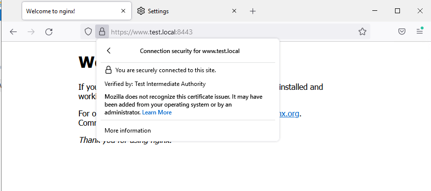

# Курсовая работа по итогам модуля "DevOps и системное администрирование"

Курсовая работа необходима для проверки практических навыков, полученных в ходе прохождения курса "DevOps и системное администрирование".

Мы создадим и настроим виртуальное рабочее место. Позже вы сможете использовать эту систему для выполнения домашних заданий по курсу

## Задание

1. Создайте виртуальную машину Linux.

Создадим в каталоге, где планируется размещение тестовой виртуальной машины файл `Vagrantfile` с базовой конфигурацией для гипервизора Oracle VirtualBox: 
Базовый образ - Ubuntu-20.04

```ruby
# -*- mode: ruby -*-
# vi: set ft=ruby :

boxes = {
  'netology' => '0',
}


$script = <<-'SCRIPT'
hostname $1

apt-get update

SCRIPT

Vagrant.configure("2") do |config|

  config.vm.box = "bento/ubuntu-20.04"

  config.vm.define "netology" do |node|
    node.vm.provider "virtualbox" do |vb|
      vb.memory = "1024"
      vb.cpus = "4"
      vb.gui = false
    end
    node.vm.hostname = "netology1.test.local"
    #node.vm.network "private_network", ip: "172.16.10.100"
    node.vm.network :forwarded_port, guest: 80, host: 8080
    node.vm.network :forwarded_port, guest: 443, host: 8443
    node.vm.network :forwarded_port, guest: 8200, host: 8200
    node.vm.synced_folder "src/", "/var/src", create: true
    node.vm.provision "shell" do |common|
      common.inline = $script
      common.args = "netology1"
    end
  end
end

```

Запустим в текущем каталоге настройку ВМ из PowerShell командой `vagrant up`:

```PowerShell
PS D:\VBox\VMs\DevOps2021\pcs-devsys-diplom\ub20> vagrant up
Bringing machine 'netology' up with 'virtualbox' provider...
==> netology: Importing base box 'bento/ubuntu-20.04'...
==> netology: Matching MAC address for NAT networking...
==> netology: Checking if box 'bento/ubuntu-20.04' version '202112.19.0' is up to date...
==> netology: Setting the name of the VM: ub20_netology_1640688537913_2157
==> netology: Clearing any previously set network interfaces...
==> netology: Preparing network interfaces based on configuration...
    netology: Adapter 1: nat
==> netology: Forwarding ports...
    netology: 80 (guest) => 8080 (host) (adapter 1)
    netology: 443 (guest) => 8443 (host) (adapter 1)
    netology: 8200 (guest) => 8200 (host) (adapter 1)
    netology: 22 (guest) => 2222 (host) (adapter 1)
==> netology: Running 'pre-boot' VM customizations...
==> netology: Booting VM...
==> netology: Waiting for machine to boot. This may take a few minutes...
    netology: SSH address: 127.0.0.1:2222
    netology: SSH username: vagrant
    netology: SSH auth method: private key
    netology: Warning: Connection reset. Retrying...
    netology: Warning: Connection aborted. Retrying...
    netology:
    netology: Vagrant insecure key detected. Vagrant will automatically replace
    netology: this with a newly generated keypair for better security.
    netology:
    netology: Inserting generated public key within guest...
    netology: Removing insecure key from the guest if it's present...
    netology: Key inserted! Disconnecting and reconnecting using new SSH key...
==> netology: Machine booted and ready!
==> netology: Checking for guest additions in VM...
==> netology: Setting hostname...
==> netology: Mounting shared folders...
    netology: /vagrant => D:/VBox/VMs/DevOps2021/pcs-devsys-diplom/ub20
    netology: /var/src => D:/VBox/VMs/DevOps2021/pcs-devsys-diplom/ub20/src
==> netology: Running provisioner: shell...
    netology: Running: inline script
    netology: Hit:1 http://us.archive.ubuntu.com/ubuntu focal InRelease
    netology: Get:2 http://us.archive.ubuntu.com/ubuntu focal-updates InRelease [114 kB]
    netology: Get:3 http://us.archive.ubuntu.com/ubuntu focal-backports InRelease [108 kB]
    netology: Get:4 http://us.archive.ubuntu.com/ubuntu focal-security InRelease [114 kB]
    netology: Get:5 http://us.archive.ubuntu.com/ubuntu focal-updates/main amd64 Packages [1,400 kB]
    netology: Get:6 http://us.archive.ubuntu.com/ubuntu focal-updates/universe amd64 Packages [884 kB]
    netology: Get:7 http://us.archive.ubuntu.com/ubuntu focal-security/main amd64 Packages [1,069 kB]
    netology: Get:8 http://us.archive.ubuntu.com/ubuntu focal-security/universe amd64 Packages [668 kB]
    netology: Fetched 4,357 kB in 46s (94.8 kB/s)
    netology: Reading package lists...
```
Проверим состояние ВМ:

```powershell
PS D:\VBox\VMs\DevOps2021\pcs-devsys-diplom\ub20> vagrant status
Current machine states:

netology                  running (virtualbox)

The VM is running. To stop this VM, you can run `vagrant halt` to
shut it down forcefully, or you can run `vagrant suspend` to simply
suspend the virtual machine. In either case, to restart it again,
simply run `vagrant up`.
```
Командой `ssh-copy-id` скопируем на новую ВМ ранее созданный публичный ключ SSH  и подключимся к ВМ по протоколу SSH под учётной записью суперпользователя (`root`).

```shell
$ ssh-copy-id -p 2222 vagrant@127.0.0.1
/usr/bin/ssh-copy-id: INFO: Source of key(s) to be installed: "/c/Users/Administrator/.ssh/id_rsa.pub"
/usr/bin/ssh-copy-id: INFO: attempting to log in with the new key(s), to filter out any that are already installed
/usr/bin/ssh-copy-id: INFO: 1 key(s) remain to be installed -- if you are prompted now it is to install the new keys
...
Number of key(s) added: 1
...
$ ssh -p 2222 root@127.0.0.1
Welcome to Ubuntu 20.04.3 LTS (GNU/Linux 5.4.0-91-generic x86_64)
...
root@netology:~#
```

2. Установите ufw и разрешите к этой машине сессии на порты 22 и 443, при этом трафик на интерфейсе localhost (lo) должен ходить свободно на все порты.

Создадим скрипт в каталоге `/root`

```bash
root@vagrant:~# cat > /root/ufw_setup
#!/usr/bin/env bash

function ufw_install() {
 apt-get update
 apt-get install -y "$1"
 if [ $? != 0 ]
 then
   echo "Error: $1" >&2
   exit 50
fi


}

# UFW install
ufw_install "ufw"  2>/dev/null

    # Disable UFW & Reset old rules
    ufw reset

    # Set default traffic policy
    ufw default deny incoming
    ufw default allow outgoing

    # Allow all to localhost
    ufw allow from 127.0.0.1/32

    # Allow incoming connection on port 22/tcp (ssh) & 80,443/tcp (web-services)
    ufw allow 22,80,443/tcp
    ufw limit 22,80,443/tcp

    # Allow connect to Hashicorp Vault Web-GUI
    ufw allow 8200/tcp


# restart UFW
ufw disable 2>/dev/null

echo 'Y' | ufw enable 2>/dev/null
if [ $? != 0 ]
 then
   echo "Error: $1" >&2
   exit 50
fi

exit 0
EOF
```  

Дадим права на запуск, выполним скрипт и проверим состояние UFW:

```bash
root@vagrant:~# chmod 700 /root/ufw_setup
root@vagrant:~# bash /root/ufw_setup
Start UFW installation.
UFW installation \& configuration completed successfully
root@vagrant:~# ufw status
Status: active

To                         Action      From
--                         ------      ----
Anywhere                   ALLOW       127.0.0.1
22,80,443/tcp              LIMIT       Anywhere
8200/tcp                   ALLOW       Anywhere
22,80,443/tcp (v6)         LIMIT       Anywhere (v6)
8200/tcp (v6)              ALLOW       Anywhere (v6)
```

3. Установите hashicorp vault ([инструкция по ссылке](https://learn.hashicorp.com/tutorials/vault/getting-started-install?in=vault/getting-started#install-vault)).

Установим Hashicorp Vault по инструкции для deb-like дистрибутивов:

```shell
root@vagrant:~# curl -fs https://apt.releases.hashicorp.com/gpg | apt-key add -
OK

root@vagrant:~# sudo apt-add-repository "deb https://apt.releases.hashicorp.com $(lsb_release -cs) main"
Get:1 https://apt.releases.hashicorp.com focal InRelease [9,495 B]
Hit:2 http://us.archive.ubuntu.com/ubuntu focal InRelease
Hit:3 http://us.archive.ubuntu.com/ubuntu focal-updates InRelease
Hit:4 http://us.archive.ubuntu.com/ubuntu focal-backports InRelease
Get:5 https://apt.releases.hashicorp.com focal/main amd64 Packages [41.1 kB]
Hit:6 http://us.archive.ubuntu.com/ubuntu focal-security InRelease
Fetched 50.6 kB in 2s (22.9 kB/s)
Reading package lists... Done

root@vagrant:~# apt-get install vault
Reading package lists... Done
Building dependency tree
Reading state information... Done
The following NEW packages will be installed:
  vault
0 upgraded, 1 newly installed, 0 to remove and 0 not upgraded.
Need to get 69.4 MB of archives.
After this operation, 188 MB of additional disk space will be used.
Get:1 https://apt.releases.hashicorp.com focal/main amd64 vault amd64 1.9.2 [69.4 MB]
Fetched 69.4 MB in 36s (1,908 kB/s)
Selecting previously unselected package vault.
(Reading database ... 40620 files and directories currently installed.)
Preparing to unpack .../archives/vault_1.9.2_amd64.deb ...
Unpacking vault (1.9.2) ...
Setting up vault (1.9.2) ...
Generating Vault TLS key and self-signed certificate...
Generating a RSA private key
...................................................++++
.......++++
writing new private key to 'tls.key'
-----
Vault TLS key and self-signed certificate have been generated in '/opt/vault/tls'.
```

Настроим переменные и службы:

```shell
root@vagrant:~# export VAULT_ADDR=http://127.0.0.1:8200
root@vagrant:~# echo 'VAULT_ADDR=http://127.0.0.1:8200' >> /etc/environment
root@vagrant:~# cat /etc/vault.d/vault.hcl
...
ui = true
storage "file" {
  path = "/opt/vault/data"
}
# HTTP listener
listener "tcp" {
  address = "0.0.0.0:8200"
  tls_disable = 1
}
...
root@vagrant:~#
root@vagrant:~# systemctl enable vault --now
Created symlink /etc/systemd/system/multi-user.target.wants/vault.service → /lib/systemd/system/vault.service.
```

Проверим состояние `vault` и инициализируем сервер с настройками по-умолчанию
```shell
root@vagrant:~# vault status
Key                Value
---                -----
Seal Type          shamir
Initialized        false
Sealed             true
Total Shares       0
Threshold          0
Unseal Progress    0/0
Unseal Nonce       n/a
Version            1.9.2
Storage Type       file
HA Enabled         false
```
```shell
root@vagrant:~# vault operator init
Unseal Key 1: au...ff
...
Unseal Key 5: zv..1Y

Initial Root Token: s.Bn..cv
...
```
Разблокируем сервер с использованием любых трёх полученных `Unseal Key` и подключимся с токеном `Initial Root Token`:
```shell
root@vagrant:~# vault operator unseal au..ff
Key                Value
---                -----
Seal Type          shamir
Initialized        true
Sealed             true
Total Shares       5
Threshold          3
Unseal Progress    1/3
Unseal Nonce       a2f410bb-0a7f-23f8-ae2a-0f9898eb8ae4
Version            1.9.2
Storage Type       file
HA Enabled         false
root@vagrant:~# vault operator unseal xe..ad
Key                Value
---                -----
Seal Type          shamir
Initialized        true
Sealed             true
Total Shares       5
Threshold          3
Unseal Progress    2/3
Unseal Nonce       a2f410bb-0a7f-23f8-ae2a-0f9898eb8ae4
Version            1.9.2
Storage Type       file
HA Enabled         false
root@vagrant:~# vault operator unseal xA..2Q
Key             Value
---             -----
Seal Type       shamir
Initialized     true
Sealed          false
Total Shares    5
Threshold       3
Version         1.9.2
Storage Type    file
Cluster Name    vault-cluster-5d48425d
Cluster ID      a300d821-cba1-f711-7ee9-43c24a9ac819
HA Enabled      false
root@vagrant:~#
root@vagrant:~# vault login
Token (will be hidden):
Success! You are now authenticated. The token information displayed below
is already stored in the token helper. You do NOT need to run "vault login"
again. Future Vault requests will automatically use this token.

Key                  Value
---                  -----
token                s.Bn..cv
token_accessor       Xt..kq
token_duration       ∞
token_renewable      false
token_policies       ["root"]
identity_policies    []
policies             ["root"]
root@vagrant:~#
```
4. Cоздайте центр сертификации по инструкции ([ссылка](https://learn.hashicorp.com/tutorials/vault/pki-engine?in=vault/secrets-management)) и выпустите сертификат для использования его в настройке веб-сервера nginx (срок жизни сертификата - месяц).

Установим утилиту `jq`
```shell
root@vagrant:~# apt-get install -y jq
Reading package lists...
Building dependency tree...
Reading state information...
The following NEW packages will be installed:
  jq
0 upgraded, 1 newly installed, 0 to remove and 0 not upgraded.
Need to get 50.2 kB of archives.
After this operation, 99.3 kB of additional disk space will be used.
Get:1 http://us.archive.ubuntu.com/ubuntu focal-updates/universe amd64 jq amd64 1.6-1ubuntu0.20.04.1 [50.2 kB]
Fetched 50.2 kB in 1s (61.2 kB/s)
Selecting previously unselected package jq.
(Reading database ... 40636 files and directories currently installed.)
Preparing to unpack .../jq_1.6-1ubuntu0.20.04.1_amd64.deb ...
Unpacking jq (1.6-1ubuntu0.20.04.1) ...
Setting up jq (1.6-1ubuntu0.20.04.1) ...
Processing triggers for man-db (2.9.1-1) ...
```

Пропишем в `/etc/hosts` адрес `test.local` как `127.0.0.1` и переопределим переменную `VAULT_ADDR` в текущем сеансе и в файле `/etc/environment`:
```shell
root@vagrant:~# export VAULT_ADDR=http://test.local:8200
...
root@vagrant:~# cat /etc/environment
PATH="/usr/local/sbin:/usr/local/bin:/usr/sbin:/usr/bin:/sbin:/bin:/usr/games:/usr/local/games:/snap/bin"
VAULT_ADDR=http://test.local:8200
```
Зададим переменную `VAULT_TOKEN`:
```shell
root@vagrant:~# export VAULT_TOKEN='s.Bn..cv'
```

Сконфигурируем `secret` для корневого CA
```shell
root@vagrant:~# vault secrets enable pki
Success! Enabled the pki secrets engine at: pki/
root@vagrant:~# vault secrets tune -max-lease-ttl=87600h pki
Success! Tuned the secrets engine at: pki/
```
Выпустим сертификат `Test Root CA` и сохраним его в файле `/root/CA_cert.crt`
```shell
root@vagrant:~# vault write -field=certificate pki/root/generate/internal \
>      common_name="Test Root CA" \
>      ttl=87600h > CA_cert.crt
root@vagrant:~# 
```
Сконфигурируем места хранения выпущенных сертификатов и списков отзывов:
```shell
root@vagrant:~# vault write pki/config/urls \
>      issuing_certificates="$VAULT_ADDR/v1/pki/ca" \
>      crl_distribution_points="$VAULT_ADDR/v1/pki/crl"
Success! Data written to: pki/config/urls
```

Аналогично сконфигурируем выпускающий CA:
```shell
root@vagrant:~# vault secrets enable -path=pki_int pki
Success! Enabled the pki secrets engine at: pki_int/
root@vagrant:~# vault secrets tune -max-lease-ttl=43800h pki_int
Success! Tuned the secrets engine at: pki_int/
root@vagrant:~# vault write -format=json pki_int/intermediate/generate/internal \
>      common_name="Test Intermediate Authority" \
>      | jq -r '.data.csr' > pki_intermediate.csr
root@vagrant:~# vault write -format=json pki/root/sign-intermediate csr=@pki_intermediate.csr \
>      format=pem_bundle ttl="43800h" \
>      | jq -r '.data.certificate' > intermediate.cert.pem
root@vagrant:~#
root@vagrant:~# vault write pki_int/intermediate/set-signed certificate=@intermediate.cert.pem
Success! Data written to: pki_int/intermediate/set-signed
```

И выпустим сертификат (bundle в формате .pem) для `CN=test.local` и SAN `DNS=www.test.local`
```shell
root@vagrant:~# vault write pki_int/roles/test-dot-local \
>      allowed_domains="test.local" \
>  allowed_other_sans='*' \
>      allow_subdomains=true \
>  allow_bare_domains=true \
>      max_ttl="720h"
Success! Data written to: pki_int/roles/test-dot-local
root@vagrant:~# vault write -format=json pki_int/issue/test-dot-local \
>   format=pem_bundle \
>   common_name="test.local" \
>   alt_names="test.local,www.test.local,netology1.test.local" \
>   ttl="720h" | jq -r '.data.certificate' > test.local.cert.pem
root@vagrant:~# 
```
5. Установите корневой сертификат созданного центра сертификации в доверенные в хостовой системе.
 Для добавления своего корневого CA в доверенные скопируем его в  `/usr/local/share/ca-certificates/test_local.crt` и запустим утилиту `update-ca-certificates`
```shell
root@vagrant:~# cp /root/CA_cert.crt /usr/local/share/ca-certificates/test_local.crt
root@vagrant:~# update-ca-certificates
Updating certificates in /etc/ssl/certs...
1 added, 0 removed; done.
Running hooks in /etc/ca-certificates/update.d...
done.
```

6. Установите nginx.
```shell
root@vagrant:~# apt-get install -y nginx
Reading package lists... Done
Building dependency tree
Reading state information... Done
The following additional packages will be installed:
  fontconfig-config fonts-dejavu-core libfontconfig1 libgd3 libjbig0 libjpeg-turbo8 libjpeg8 libnginx-mod-http-image-filter libnginx-mod-http-xslt-filter libnginx-mod-mail libnginx-mod-stream libtiff5
  libwebp6 libx11-6 libx11-data libxau6 libxcb1 libxdmcp6 libxpm4 nginx-common nginx-core
Suggested packages:
  libgd-tools fcgiwrap nginx-doc ssl-cert
The following NEW packages will be installed:
  fontconfig-config fonts-dejavu-core libfontconfig1 libgd3 libjbig0 libjpeg-turbo8 libjpeg8 libnginx-mod-http-image-filter libnginx-mod-http-xslt-filter libnginx-mod-mail libnginx-mod-stream libtiff5
  libwebp6 libx11-6 libx11-data libxau6 libxcb1 libxdmcp6 libxpm4 nginx nginx-common nginx-core
0 upgraded, 22 newly installed, 0 to remove and 0 not upgraded.
...
```
Проверим версию установленного ПО:
```shell
root@vagrant:~# nginx -v
nginx version: nginx/1.18.0 (Ubuntu)
```

7. По инструкции ([ссылка](https://nginx.org/en/docs/http/configuring_https_servers.html)) настройте nginx на https, используя ранее подготовленный сертификат:
  - можно использовать стандартную стартовую страницу nginx для демонстрации работы сервера;
  - можно использовать и другой html файл, сделанный вами;

Создадим каталог `/etc/nginx/ssl/test.local/` и скопируем в него bundle `test.local.cert.pem`
```shell
root@vagrant:~# mkdir /etc/nginx/ssl/
root@vagrant:~# mkdir /etc/nginx/ssl/test.local/
root@vagrant:~# cp test.local.cert.pem /etc/nginx/ssl/test.local/
```

Создадим каталог `/var/www/test.local/public_html/` и скопируем в него дефолтную web-страницу NGINX
```shell
root@vagrant:~# mkdir /var/www/test.local
root@vagrant:~# mkdir /var/www/test.local/public_html/
root@vagrant:~# cp /var/www/html/index.nginx-debian.html /var/www/test.local/public_html/index.html
```

Создадим файл конфигурации для тестового сайта:
```shell
root@netology:~# cat /etc/nginx/sites-available/test_dot_local
server {
        listen 443 ssl;
        server_name test.local www.test.local;

        access_log /var/log/nginx/test.local.access.log;

        root /var/www/test.local/public_html/;
        index index.html index.htm;

        ssl_certificate      /etc/nginx/ssl/test.local/test.local.cert.pem;
        ssl_certificate_key  /etc/nginx/ssl/test.local/test.local.cert.pem;

        location / {
                try_files $uri $uri/ =404;
        }
}
```
Сделаем софт-линк на созданный конфиг в каталоге `/etc/nginx/sites-enabled`
```shell
root@vagrant:~# ln -s /etc/nginx/sites-available/test_dot_local /etc/nginx/sites-enabled/
root@vagrant:~# ls /etc/nginx/sites-enabled/
default  test_dot_local
```
Поменяем настройки SSL в файле `/etc/nginx/nginx.conf` :
```shell
http {
...
        ##
        # SSL Settings
        ##
        ssl_session_cache   shared:SSL:10m;
        ssl_session_timeout 10m;
        ssl_protocols       TLSv1.2 TLSv1.3;
        ssl_ciphers         HIGH:!aNULL:!MD5;
        ssl_prefer_server_ciphers on;
...
}
```

И проверим корректность синтаксиса:
```shell
root@vagrant:~# nginx -t
nginx: the configuration file /etc/nginx/nginx.conf syntax is ok
nginx: configuration file /etc/nginx/nginx.conf test is successful
```

Перезапустим NGINX:
```shell
root@vagrant:~# systemctl restart nginx
root@vagrant:~# systemctl status nginx
● nginx.service - A high performance web server and a reverse proxy server
     Loaded: loaded (/lib/systemd/system/nginx.service; enabled; vendor preset: enabled)
     Active: active (running) since Tue 2021-12-28 19:38:20 UTC; 6s ago
       Docs: man:nginx(8)
    Process: 24107 ExecStartPre=/usr/sbin/nginx -t -q -g daemon on; master_process on; (code=exited, status=0/SUCCESS)
    Process: 24119 ExecStart=/usr/sbin/nginx -g daemon on; master_process on; (code=exited, status=0/SUCCESS)
   Main PID: 24122 (nginx)
      Tasks: 5 (limit: 1070)
     Memory: 5.3M
     CGroup: /system.slice/nginx.service
             ├─24122 nginx: master process /usr/sbin/nginx -g daemon on; master_process on;
             ├─24123 nginx: worker process
             ├─24124 nginx: worker process
             ├─24125 nginx: worker process
             └─24126 nginx: worker process

Dec 28 19:38:20 vagrant systemd[1]: Starting A high performance web server and a reverse proxy server...
Dec 28 19:38:20 vagrant systemd[1]: Started A high performance web server and a reverse proxy server.
```

8. Откройте в браузере на хосте https адрес страницы, которую обслуживает сервер nginx.



9. Создайте скрипт, который будет генерировать новый сертификат в vault:
  - генерируем новый сертификат так, чтобы не переписывать конфиг nginx;
  - перезапускаем nginx для применения нового сертификата.

```bash
#!/usr/bin/env bash
# Renew cert for test.local
# Prereqs: Hasicorp Vault, NGINX, OpenSSL, JQ

# Vars

VAULT_TOKEN='s.BnJd5fmY8dF3ZSnIYutVsScv'
cert_file_name='test.local.cert.pem'
site_ssl_dir='/etc/nginx/ssl/test.local'

# Funcs
function create_new_cert() {
  vault write -format=json pki_int/issue/test-dot-local \
    format=pem_bundle \
    common_name="test.local" \
    alt_names="test.local,www.test.local,netology.test.local" \
    ttl="720h" | jq -r '.data.certificate' >$1
  echo "Check 1"
}

#MAIN
site_cert_full_path="$site_ssl_dir/$cert_file_name"

# Check vault is sealed
seal_vault=$(vault status)
if grep -q 'Sealed             true' <<<$seal_vault; then
  echo 'ERROR: VAULT SEALED' >&2
  exit 50
fi

# Login into vault with root creds
vault login $VAULT_TOKEN &>/dev/null
if [ $? != 0 ]; then
  echo "Can\`t login into vault: $?" >&2
  exit 51
fi

# Revoke & delete old cert
cert_sn=$(openssl x509 -noout -serial -in test.local.cert.pem)        # Get SN from current cert
cert_serial_number=$(sed 's/.*=//g;s/../&:/g;s/:$//' <<<$cert_sn)     # Convert SN to xx:xx view
vault write pki_int/revoke serial_number="$cert_serial_number"        # Revoke cert w SN
vault write pki_int/tidy tidy_cert_store=true tidy_revoked_certs=true # Delete revoked certs

# Request new certificates
create_new_cert $cert_file_name

# Place new cert into site SSL dir
cp $cert_file_name $site_cert_full_path

# Restart NGINX to commit changes
systemctl restart nginx

echo 'All done'

exit 0
EOF
```

10. Поместите скрипт в crontab, чтобы сертификат обновлялся какого-то числа каждого месяца в удобное для вас время.

```shell
root@netology:~# crontab -l
# Edit this file to introduce tasks to be run by cron.
#
# Each task to run has to be defined through a single line
# indicating with different fields when the task will be run
# and what command to run for the task
#
# To define the time you can provide concrete values for
# minute (m), hour (h), day of month (dom), month (mon),
# and day of week (dow) or use '*' in these fields (for 'any').
#
# Notice that tasks will be started based on the cron's system
# daemon's notion of time and timezones.
#
# Output of the crontab jobs (including errors) is sent through
# email to the user the crontab file belongs to (unless redirected).
#
# For example, you can run a backup of all your user accounts
# at 5 a.m every week with:
# 0 5 * * 1 tar -zcf /var/backups/home.tgz /home/
#
# For more information see the manual pages of crontab(5) and cron(8)
#
# m h  dom mon dow   command
*/15 *  *   *   *    /usr/bin/bash /root/cert_renew.sh &>/dev/null

```

## Результат

Результатом курсовой работы должны быть снимки экрана или текст:

- Процесс установки и настройки ufw
- Процесс установки и выпуска сертификата с помощью hashicorp vault
- Процесс установки и настройки сервера nginx
- Страница сервера nginx в браузере хоста не содержит предупреждений 
- Скрипт генерации нового сертификата работает (сертификат сервера ngnix должен быть "зеленым")
- Crontab работает (выберите число и время так, чтобы показать что crontab запускается и делает что надо)

## Как сдавать курсовую работу

Курсовую работу выполните в файле readme.md в github репозитории. В личном кабинете отправьте на проверку ссылку на .md-файл в вашем репозитории.

Также вы можете выполнить задание в [Google Docs](https://docs.google.com/document/u/0/?tgif=d) и отправить в личном кабинете на проверку ссылку на ваш документ.
Если необходимо прикрепить дополнительные ссылки, просто добавьте их в свой Google Docs.

Перед тем как выслать ссылку, убедитесь, что ее содержимое не является приватным (открыто на комментирование всем, у кого есть ссылка), иначе преподаватель не сможет проверить работу. 
Ссылка на инструкцию [Как предоставить доступ к файлам и папкам на Google Диске](https://support.google.com/docs/answer/2494822?hl=ru&co=GENIE.Platform%3DDesktop).
